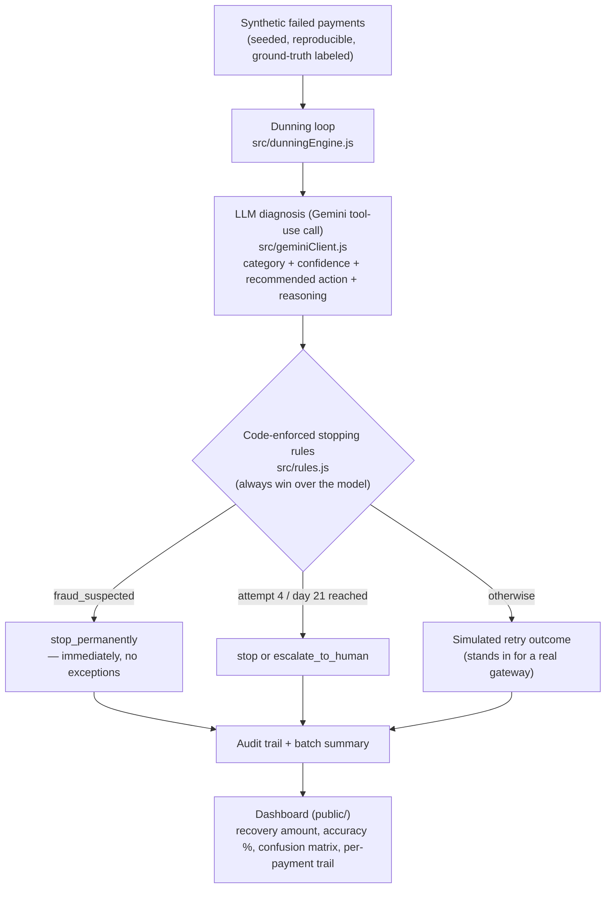

# Revenue Recovery Agent

Razorpay AI Buildathon — Track 03: AI Revenue Recovery

## The problem

Subscription payments fail for a lot of reasons — insufficient funds, an
expired card, a bank flagging fraud, a temporary server timeout. Every one of
those needs a *different* response, but most systems treat them all the same
way:

- **Retry everything blindly** — wastes money hammering a card that will
  never succeed, and is actively dangerous if the card was reported stolen
  (you're re-attempting a fraud case).
- **Give up too early** — a customer who just needed a "please update your
  card" nudge gets treated the same as someone who was never coming back,
  and recoverable revenue is lost for nothing.

This agent diagnoses *why* each payment failed, picks the one right next
move for that specific reason, and recovers what can actually be recovered —
while staying inside hard compliance and spam limits no matter what the AI
recommends.

## How it works



The diagnosis is made **once per payment**, not once per retry attempt — the
gateway decline message doesn't change between attempts, so re-asking the
model to re-confirm the same diagnosis on every retry would just burn API
quota for no new information. Retry cadence after that first diagnosis is
governed entirely by the deterministic rules in `rules.js`.

**Key design choice: the model recommends, the code decides.** Every
recommendation passes through `rules.js` before anything happens, and every
time the code overrides the model, that override is logged (`overridden`
field) and visible in the audit trail. This is what makes the agent
"compliant and bounded" rather than letting an LLM freely decide how many
times to contact a customer or whether to keep retrying a suspected-fraud
card.

## What's real vs. simulated

- **Real:** the classification + decision call to Gemini (structured
  tool-use output, not parsed free text), the stopping-rule enforcement, the
  audit trail, the aggregate reporting, and the accuracy measurement against
  ground truth.
- **Simulated:** whether a retry/nudge actually succeeds. There's no live
  payment gateway in this sandbox, so outcomes are drawn from a seeded
  probability model per decline category (`RETRY_SUCCESS_PROB` in
  `src/rules.js`). In production, the "execute" step would call Razorpay's
  actual retry/notification APIs and this simulation would be replaced by
  the real result.

## Measured results (40-payment batch, real Gemini calls, seed 42)

| Metric | Result |
|---|---|
| Total at-risk amount | ₹39,054.99 |
| Amount recovered | ₹18,894.56 |
| Recovery rate | 52.5% (21/40) |
| Escalated to human | 0 |
| Given up (exhausted rules, no fraud) | 19 |
| **Classification accuracy vs. ground truth** | **100% (36/36 scorable)** |

4 of the 40 payments use a deliberately ambiguous decline message
(`"Transaction declined - error code 51."`) with no single correct category
by design — these are excluded from the accuracy score above, and the
dashboard reports what the model did with them separately instead of
pretending there's a right answer to grade against.

**Why the accuracy number is trustworthy, not vanity:** the synthetic dataset
tags every decline message with a real ground-truth category
(`src/syntheticData.js`), so the model's diagnosis can be checked, not just
trusted. The first version scored **50% accuracy** on this exact batch — the
model was confusing "card needs the customer to fix something" (expired
card, bad CVV) with "bank permanently declined it" (do-not-honor, blocked
for security), because the schema gave it category *names* with no
definitions. Adding one paragraph of explicit definitions to the schema
(`ACTION_SCHEMA` in `src/mockClient.js`) took accuracy to **100%** on the
identical batch — a measured before/after, not a guess.

## Running it

```bash
npm install
cp .env.example .env
```

Get a free Gemini API key at [aistudio.google.com](https://aistudio.google.com)
(Google account, no card, no phone verification) and paste it into `.env` as
`GEMINI_API_KEY=...`. Then:

```bash
npm start
```

Open http://localhost:3000 and click **Run Batch**. Without any API key set,
the engine falls back to a keyword-based mock classifier so the full
pipeline (stopping rules, simulation, dashboard) is still exercisable
end-to-end for development — useful for iterating on the UI without
spending API quota.

**Free-tier quota note:** Gemini's free tier enforces both a per-minute and
a per-day request cap, and the cap is tracked *per model name*. This project
uses `gemini-3.5-flash-lite` specifically because it carries a much higher
free-tier allowance than the full `-flash` models, and pairs that with
proactive request pacing plus retry-with-backoff (`src/geminiClient.js`) so
a batch run degrades gracefully instead of crashing if the quota is ever hit
mid-batch (`hadLlmError` is flagged per payment in that case, and that
payment's diagnosis falls back to the keyword classifier rather than taking
down the whole batch).

## Judging criteria mapping

- **Measured money recovered across a batch:** summary panel reports
  recovery rate %, total ₹ recovered, escalated/given-up counts, and
  classification accuracy over the full batch — not a single cherry-picked
  example (see table above for real numbers from a real run).
- **Compliant escalation:** fraud-suspected cases stop immediately;
  unresolved cases after the retry window escalate to a human rather than
  looping forever.
- **Stopping rules:** hard-coded in `src/rules.js`, enforced in
  `src/dunningEngine.js` regardless of what the model suggests, and every
  override is logged.
- **Audit trail:** every payment has a full per-attempt history — category,
  confidence, model recommendation, actual action taken, override flag,
  customer message, reasoning, and predicted-vs-ground-truth category —
  viewable per-row in the dashboard.

## Known limitations (worth saying out loud in the pitch)

- Outcome simulation is probabilistic, not a real gateway integration.
- Synthetic dataset is small (default 40) and messages are drawn from a
  fixed pool of 12 templates — real gateway decline text is messier and more
  varied than this.
- No real customer messaging (email/SMS) is sent; `customer_message` is
  generated but only logged.
